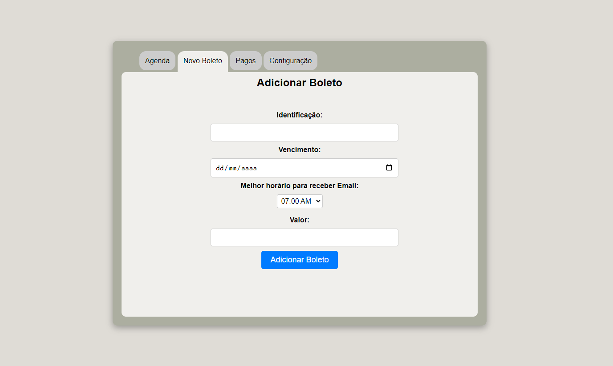

# Projeto de TI - Agenda de Boletos

Sistema de alerta de vencimento de boletos
para melhorar a gestão financeira da empresa Virtual Brindes. O sistema a ser
desenvolvido atingirá os objetivos propostos pelo gerente, pois será capaz de
identificar boletos próximos do vencimento, gerar avisos prévios e entregar
notificação de maneira confiável.
A automação pode ajudar a evitar juros por
atraso, isso contribuirá para uma melhor gestão da empresa.
Este projeto exemplifica a capacidade de resolver problemas do mundo real
por meio da tecnologia e da inovação. Sua implementação pode
ter um impacto positivo na vida das pessoas, ajudando a evitar dívidas acumuladas e
promovendo uma melhor saúde financeira.

## Principais Bibliotecas
- Python 3.10.11
- Flask
- SQLite
- SQLAlchemy

## Como Executar
# 1.
- necessário ter o arquivo .env
- clonar o repositorio `git clone <link-repositorio>`
- criar .venv `python -m venv .venv` (windows)
- ativar .venv `.venv\Scripts\activate` (windows)
- instalar bibliotecas `pip install -r requirements.txt`
- executar aplicação `python app.py`

# 2.
- executar `python run.py` na no terminal da .venv e abrir o link do servidor

# A fazer:
- [x] fontend, html e css
- [x] backend, rotas, crud 
- [x] logica de notificacoes 
- [x] backend, adicionar erros
- [x] backend, criar funcionaliade para mostrar erros
- [x] backend, ajustar endpoint 'editar'

# Imagens

